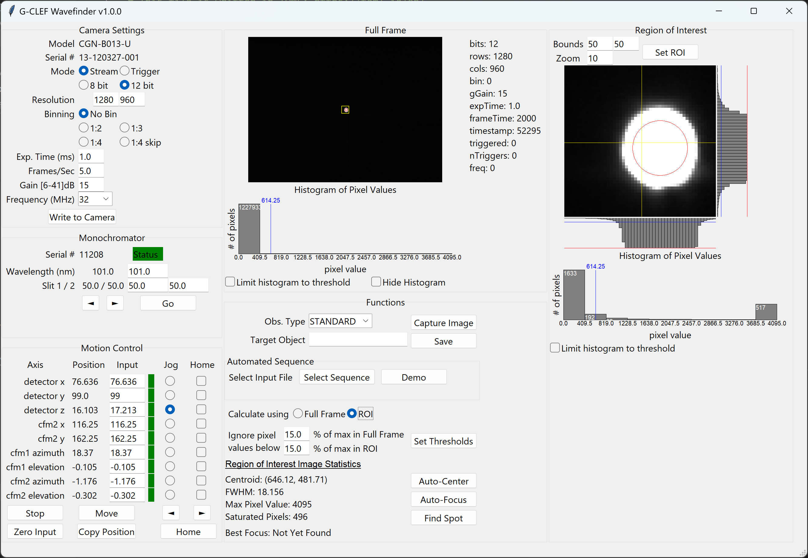

# G-CLEF Wavefinder
G-CLEF Wavefinder is graphical software for G-CLEF camera assembly, integration, testing, verification, and validation.

* [Features](#features)
* [Prerequisites](#prequisites)
* [Installation](#installation)
* [Run the Application](#run-the-application)
* [Appendix](#appendix)
    * [Mightex Camera Documentation](#mightex-camera-documentation)
    * [Galil Motion Control](#galil-motion-control)
    * [Drivers](#drivers)
    * [Powershell Permissions](#powershell-permissions)


## Features


* Mightex Buffered USB Camera interface
  - Configure all camera settings
  - Video streaming and single-exposure trigger modes
* Motion control of Zaber linear axes and Newmark rotating gimbals
  - Absolute positioning
  - Fine motion jog
  - Homing functions
  - Axis status and error detection
* Region of Interest visualization
* Cross-cuts
* Histogram
* Image statistics
  - background deletion by threshold
  - centroid
  - full-width half-max
* Automatic image centering
* Automatic focus
* Save images in FITS format
* Run a sequence of commands from an input table


## Prequisites
* Microsoft Windows 10 or 11 operating system (also works in WSL)
* Python 3.11 or 3.12 with Tcl/Tk from https://www.python.org (not Windows Store)
* [WinUSB drivers for Mightex camera](#drivers) (links to instructions)
* Galil API: https://www.galil.com/downloads/api


## Installation
Follow these steps on Windows, Using Powershell. For WSL, see [doc/WSL.md](doc/WSL.md).
1. Ensure prequisites are installed.
1. Clone repository:
    ```
    $ git clone git@github.com:Smithsonian/gclef-wavefinder.git
    ```
1. Make a Python virtual environment:
    ```
    > py -m venv .venv
    ```
1. Activate environment:
    ```
    > .\.venv\Scripts\activate
    ```
    * If you get an error, see [Powershell Permissions](#powershell-permissions).
1. Install Galil's `gclib` Python module:
    ```
    > pip install --use-pep517 Galil_SDK/
    ```
1. Install wavefinder:
    ```
    > pip install -e .
    ```
    * -e is for edit mode, omit if you won't edit the code


## Run the Application
See `config.toml` for all configurable parameters, the defaults, and descriptions.

Run the application from Powershell, *after activating the Python virtual environment*:
```
(.venv) > py main.py
```

See the [User Guide](doc/UserGuide.md) for a tutorial.


## Appendix
* [Mightex Camera Documentation](#mightex-camera-documentation)
* [Galil Motion Control](#galil-motion-control)
* [Drivers](#drivers)
* [Powershell Permissions](#powershell-permissions)

### Mightex Camera Documentation
See [doc/Mightex.md](doc/Mightex.md).

### Galil Motion Control
See folder `Galil_SDK` for Galil motion control utilities.

|                         |                                                 |
| ----------------------- | ----------------------------------------------- |
| `Galil_SDK/gclib.py`    | Python wrapper for Galil gclib                  |
| `Galil_SDK/HOME`        | Homing routine example, runs on controller      |
| `Galil_SDK/setup.py`    | installation script for Python wrapper          |
| `Galil_SDK/terminal.py` | terminal program to communicate with controller |

### Drivers
The included Mightex drivers don't play nicely with `pyusb` and `libusb`, so we need to install the *WinUSB* driver.
1. Download Zadig: https://zadig.akeo.ie/
1. In Zadig, select Options -> List All Devices
1. In the drop-down list, select "USB-BUF-CCD-1"
    * Check that USB ID = (0484, 0528)
1. Install the WinUSB driver to the device.

### Powershell Permissions
* You may see a permissions error:
    ```
        > .\.venv\Scripts\activate
        .\.venv\Scripts\activate : File C:\Users\A_COnyuksel\Software\gclef-wavefinder\.venv\Scripts\Activate.ps1 cannot be loaded because running scripts is disabled on this system.
        + .\.venv\Scripts\activate
        + ~~~~~~~~~~~~~~~~~~~~~~~~
            + CategoryInfo          : SecurityError: (:) [], PSSecurityException
            + FullyQualifiedErrorId : UnauthorizedAccess
    ```
* To solve this permanently, give your user more access:
    ```
    > Set-ExecutionPolicy -Scope CurrentUser RemoteSigned
    ```
* Read more about it: https://learn.microsoft.com/en-us/powershell/module/microsoft.powershell.core/about/about_execution_policies
