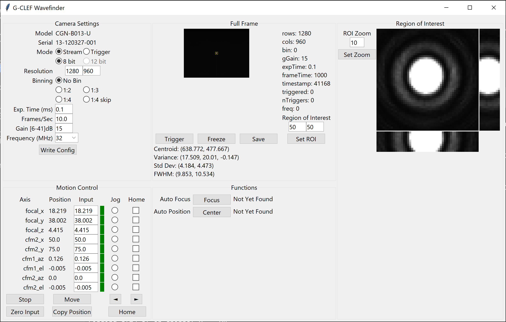

# G-CLEF Wavefinder
This graphical software for G-CLEF camera AIT lab prototyping measures optical performance at various wavelengths.

* [Features](#features)
* [Prerequisites](#prequisites)
* [Install & Run](#install--run)
    * [Additional Steps for WSL](#additional-steps-for-wsl)
* [Mightex Camera Information](#mightex-camera-information)
    * [Drivers](#drivers)
    * [Documentation](#mightex-sdk-and-documentation)

## Features
* Mightex Buffered USB Camera interface
  - Configure all camera settings
  - Video streaming and single-exposure trigger modes
* Motion control of Zaber linear axes and Newmark rotating gimbals
  - Absolute positioning
  - Fine motion jog
  - Homing functions
  - Axis status and error detection
* Region of Interest visualization
* Cross-cuts
* Histogram
* Image statistics
  - background deletion by threshold
  - centroid
  - full-width half-max
* Automatic image centering
* Automatic focus
* Save images in FITS format
* Run from a table of scripted configurations



## Prequisites
* Microsoft Windows 10  operating system (also works in WSL)
* Python 3.11 with Tcl/Tk from https://www.python.org (not Windows Store)
* WinUSB drivers for Mightex camera: [instructions](#drivers)
* Galil API: https://www.galil.com/downloads/api

## Install & Run
On Windows 10, Using Powershell
1. Ensure prequisites are installed.
1. Clone repository:
    ```
    $ git clone git@github.com:Smithsonian/zaber-focus.git
    ```
1. Make a Python virtual environment:
    ```
    > py -m venv .venv
    ```
1. Activate environment:
    ```
    >  .\.venv\Scripts\activate
    ```
    * You may see a permissions error:
        ```
            > .\.venv\Scripts\activate
            .\.venv\Scripts\activate : File C:\Users\A_COnyuksel\Software\gclef-wavefinder\.venv\Scripts\Activate.ps1 cannot be loaded because running scripts is disabled on this system.
            + .\.venv\Scripts\activate
            + ~~~~~~~~~~~~~~~~~~~~~~~~
                + CategoryInfo          : SecurityError: (:) [], PSSecurityException
                + FullyQualifiedErrorId : UnauthorizedAccess
        ```
    * To solve this permanently, give your user more access:
        ```
        > Set-ExecutionPolicy -Scope CurrentUser RemoteSigned
        ```
    * Read more about it: https://learn.microsoft.com/en-us/powershell/module/microsoft.powershell.core/about/about_execution_policies?view=powershell-7.3

1. Install Galil's `gclib` Python module:
    ```
    > pip install --use-pep517 Galil_SDK/
    ```
1. Install wavefinder:
    ```
    > pip install -e .
    ```
    * -e is for edit mode, omit if you won't edit the code

**Run the application:**
```
> py main.py
```

### Additional Steps for WSL
1. Follow installation instructions in previous section.
1. Add user to `plugdev` and `dialout` groups:
    ```
    $ sudo usermod -a -G plugdev <username>
    $ sudo usermod -a -G dialout <username>
    ```
1. Log out and log back in to set new group membership.
    ```
    $ groups
    ```
1. Install udev rule:
    ```
    $ sudo cp sys/Linux/10-local.rules /etc/udev/rules.d/
    ```
1. On host machine, install https://github.com/dorssel/usbipd-win

    Short version: in an *Admin Powershell* terminal:
    ```
    > winget install usbipd
    ```
1. Reboot host machine.
1. Plug in (or re-plug) Mightex camera USB.
1. Attach USB device to WSL. In an *Admin Powershell* terminal:
    ```
    > usbipd wsl list
    > usbipd wsl attach --busid <busid>
1. Check USB device in WSL (look for device existence and correct permissions):
    ```
    $ lsusb
    $ dmesg
    $ ls -al /dev/bus/usb/001/
    ```
1. Similarly, `usbipd wsl attach` the USB devices corresponding to `/dev/ttyUSB0` and `/dev/ttyUSB1`. These should be called something like "USB Serial Converter" in `usbipd wsl list`.

#### Notes
* `lsusb` should show something like:
    ```
    Bus 001 Device 002: ID 04b4:0528 Cypress Semiconductor Corp. USB-BUF-CCD-1
    ```
* `dmesg` should show something like:
    ```
    [ 8162.977561] usb 1-1: new high-speed USB device number 2 using vhci_hcd
    [ 8163.137663] usb 1-1: SetAddress Request (2) to port 0
    [ 8163.170946] usb 1-1: New USB device found, idVendor=04b4, idProduct=0528, bcdDevice= 0.00
    [ 8163.171465] usb 1-1: New USB device strings: Mfr=1, Product=2, SerialNumber=0
    [ 8163.171757] usb 1-1: Product: USB-BUF-CCD-1
    [ 8163.171905] usb 1-1: Manufacturer: Mightex
    ```

## Mightex Camera Information
### Drivers
The included Mightex drivers don't play nicely with `pyusb` and `libusb`, so we need to install the *WinUSB* driver.
1. Download Zadig: https://zadig.akeo.ie/
1. In Zadig, select Options -> List All Devices
1. In the drop-down list, select "USB-BUF-CCD-1"
    * Check that USB ID = (0484, 0528)
1. Install the WinUSB driver to the device.

### Mightex SDK and Documentation
See folder `Mightex_SDK` for Mightex SDK and documentation. Some key files:
* `Mightex_SDK/Camera_Start_Guide.pdf`: quick start guide
* `Mightex_SDK/Documents/Mightex Buffer USB CCD Camera User Manual.pdf`: how to install drivers and use the included example program
* `Mightex_SDK/SDK/Documents/Mightex Buffer USB CCD Camera USB Protocol.pdf`: USB protocol information (used to make this application)
* `Mightex_SDK/Driver/Windows7/`: included driver files; DO NOT USE, see [Drivers](#drivers).

### Data Structures from Mightex Camera
```
Typedef struct
{
  tUINT16 Row;
  tUINT16 Column;
  tUINT16 Bin;
  tUINT16 XStart;
  tUINT16 YStart;
  tUINT16 RedGain;
  tUINT16 GreenGain;
  tUINT16 BlueGain;
  tUINT16 TimeStamp;
  tUINT16 TriggerEventOccurred;
  tUINT16 TriggerEventCount;
  tUINT16 UserMark;
  tUINT16 FrameTime;
  tUINT16 CCDFrequency;
  tUINT32 ExposureTime;
  tUINT16 Reserved[240];
} tFrameProperty; // Note: Sizeof (tFrameProperty) is 512 byte.
```
```
Typedef struct
{
  // For 8bit mode, e.g. PixelData[1040][1392] for CCX-B013-U module, PixelData[960][1280] for CGX
  // modules.
  tUINT8 PixelData[RowNumber][ColumnNumber];
  /*
  * For 12bit mode, we have the following:
  * tUINT8 PixelData[RowNumber][ColumnNumber][2]; // 12 bit camera
  * and PixelData[][][0] contains the 8bit MSB of 12bit pixel data, while the 4 LSB of PixelData[][][1] has
  * the 4bit LSB of the 12bit pixel data.
  */
  tUINT8 Paddings[]; // Depends on different resolution.
  tFramePropery ImageProperty; // Note: Sizeof (tFrameProperty) is 512 byte.
} tImageFrame;
```
```
#define STRING_LENGTH 14
typedef struct
{
  BYTE ConfigRevision;
  BYTE ModuleNo[STRING_LENGTH];
  BYTE SerialNo[STRING_LENGTH];
  BYTE ManuafactureDate[STRING_LENGTH];
} tDeviceInfo;
```
